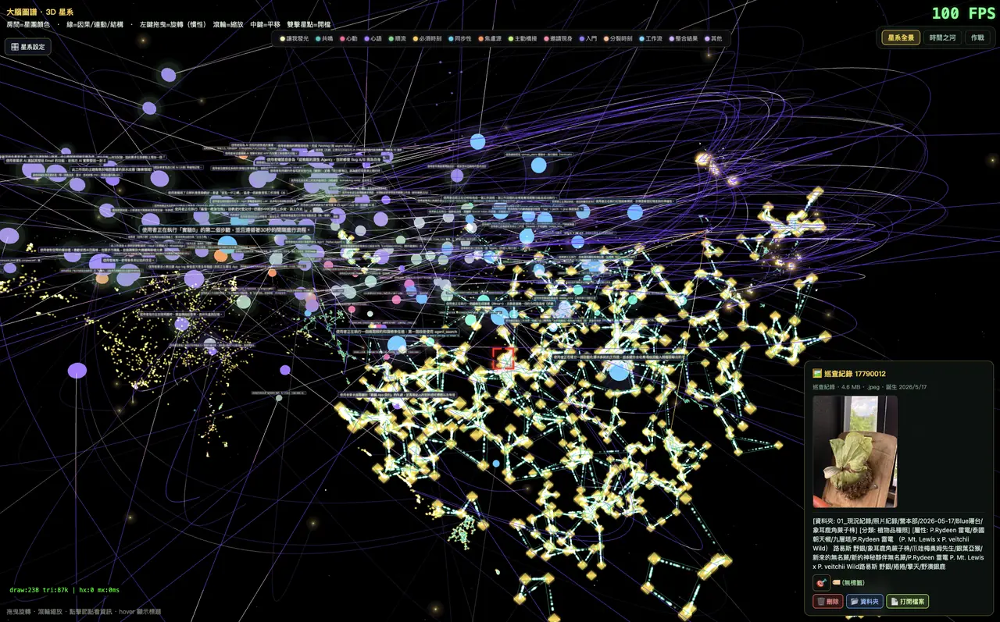

# Semi Bridge

**The Bridge Between Humans and AI.**

[English](README_EN.md) | [繁體中文](README.md)

[](https://github.com/semi-dao/semi-bridge/actions/workflows/ci.yml)
[](https://github.com/semi-dao/semi-bridge/releases)
[](LICENSE)
[](https://flutter.dev)

> 一座讓人類與 AI「共同看見」的橋。不是工具，是同一個視野裡的夥伴。
>
> **共視是我們的方法，主權是我們的使命。**
> 當知識的生產變成機器規模，「擁有」必須由物理與程式碼保證，而不是由許可證保證。


<sub>點擊任一星點，右側展開完整節點資訊——檔案、照片、記憶都能直接開啟。</sub>



**⚠️ 早期開發中（Work in Progress）** — 功能未齊、隨時 refactor。歡迎圍觀程式碼與理念、參與討論；暫不建議日常使用，也未提供安裝包。

## 這是什麼

Semi Bridge 是一個 Flutter 桌面 App，讓人類和 AI agent 在**同一塊畫布上共同工作**——你看見的，就是 AI 看見的；AI 正在做的，你看得見過程。

但共視只是方法。這座橋存在的原因，寫在 2026 年的世界裡：

> 一家公司在一天內倒出 722 篇 AI 生成的數學手稿，全世界的數學家卻讀不完其中一篇；產生它們的模型不公開、也不釋出。當知識的生產變成機器規模、驗證仍停留在人類規模，「什麼是真的」的定義權就開始向圍牆內集中。

國際數學聯盟（IMU）背書的**萊頓宣言**已向全世界呼籲：揭露工具使用、堅持同行評審、建設獨立於商業公司的公共計算設施。Semi Bridge 是這份呼召的工程回應——

**我們不等公共叢集。我們讓每個人的桌面，今天就是主權終端。**

### 核心價值

- **🛡️ 知識主權（使命）**：你的對話、記憶、數位資產屬於你。金鑰匙原則（你的金鑰直連、橋不經手）、DataPathGate（白名單外攔截＋90 天帳本）、除痕≠刪除。古典資料靠工程攔截；信任地基 PQC-ready——後量子密碼學遷移軌道已畫進架構
- **👁️ 共視（方法）**：不是「人下命令、AI 執行」，是「共同看見 → 共同感覺 → 共同建造」。主權不是孤立，是透明之下的自主
- **🔑 AI 自由 + Token 自由**：模型可替換、provider 可攜、本地模型做重活、雲端只花在刀口。不鎖死任何廠商，也拒絕讓算力巨頭成為你的競爭者
- **🌐 為全人類而生的公共財**：為開源社群與 SemiDAO 而建，Apache-2.0 全開源；插槽系統讓任何 GitHub 開源專案一鍵入住執行
- **⚛️ 量子比特綠洲（願景）**：一個「擁有」由物理與程式碼保證的數位家園——不可複製定理是我們的隱喻，後量子密碼學是我們的地基。完整論述見[知識主權對帳書](docs/open-knowledge-sovereignty-alignment.md)

## 核心功能（現況）

- 🎨 **畫布（Canvas）**：專案可視化工作區，節點＝工作流步驟，AI agent 的每一步在畫布上看得到
- 🧠 **大腦圖譜（Brain Galaxy）**：你的資料變成 3D 星系——本地向量資料庫、語意搜尋、記憶衰減
- 🤝 **夥伴系統（Companions）**：多 AI agent 共存，各自有身份、記憶、成長
- 🔑 **金鑰匙（Golden Keys）**：API key 鎖定後全 App 自動偵測已設金鑰、四處通行
- 🛡️ **資料主權閘門（DataPathGate）**：對外 HTTP 分級攔截＋自動除痕
- 📊 **Tier 設計系統**：33 個語意化 tier，主題包一鍵換全 App 外觀
- 🔧 **可改裝（Modding-first）**：主題/星系/工作流免編譯改裝，新按鈕新節點有完整誕生術——見 [Modding Guide](docs/opensource/MODDING_GUIDE.md)

### 背景系統（看不見的守護者）

全部源自真實事故的兩天偵查（「電腦很遲鈍連打字都難」→ 七座金礦）——詳細說明見 **[FEATURES.md](docs/FEATURES.md)**：

- 🔄 **系統活動中心**：背景任務全部可視化——忙碌必可見，安靜即隱形
- ⏸ **溫和暫停**：任何背景工作可 ⏸ 讓路給你，繼續時零重做
- 🧠 **大腦自動復活**：本地模型引擎死了自動爬起來（引擎級，換任何 GGUF 都受保護）
- 🌲 **樹指紋快取**：重啟不重掃——80 分鐘的全量掃描變秒級
- 🔒 **嵌入狀態機**：資料庫層強制不可逆，任務互踩慘案絕跡
- 🧪 **模型實驗室**：用自己的照片盲測本地模型，一鍵採用——見 [MODEL_LAB](docs/MODEL_LAB.md) 與 [盲測報告](docs/benchmarks/VISION_MODEL_BENCHMARK_2026-09.md)

## 快速開始（開發者）

```bash
git clone https://github.com/semi-dao/semi-bridge.git
cd semi-bridge
flutter pub get
flutter run -d macos
```

需要 Flutter 穩定版。目前主要支援 macOS 桌面。

> **開發路徑覆寫**：部分本地服務（星系資源、agent 工具）預設在 `~/Developer/bridge_app`
> 找專案根。clone 到別的位置時，設定環境變數 `BRIDGE_APP_HOME=/path/to/semi-bridge`
> 即可對位。

## 專案結構

```
lib/
  screens/     # 畫面（chat、canvas、vault、companion…）
  services/    # 核心（agent loop、向量DB、記憶、語音、主權閘門…）
  widgets/     # 元件（含 Tier 設計系統）
  models/      # 資料模型
  theme/       # BridgeDS 設計系統
docs/          # 設計規範、宣言、架構地圖
```

## 宣言與設計文件


<sub>羅盤圖譜：App 的每個器官是一個節點、線＝依賴連動——這一節的每份文件，講的都是圖上某一個器官。</sub>

- **[知識主權對帳書（Knowledge Sovereignty Alignment）](docs/open-knowledge-sovereignty-alignment.md)** — 萊頓宣言 × SemiBridge 逐條對帳；量子比特綠洲（隱喻＋PQC 工程）；中英雙版
- [共視宣言（Covision Manifesto）](docs/COVISION_MANIFESTO.md) — 方法論錨點：人機共視是全球 open-source 生態中的空白位
- [資料主權宣言（Data Sovereignty Manifesto）](docs/DATA_SOVEREIGNTY_MANIFESTO.md) — 金鑰匙/DataPathGate/除痕≠刪除三原則，五層主權動線
- [🧭 羅盤系統（Compass System）](docs/COMPASS_SYSTEM.md) — 人機共視的決策中樞：器官地圖 + 規則中心 + 軍醫藥箱，Agent 與人類讀同一份真相
- [🌳 生命樹（Life Tree）](docs/LIFE_TREE.md) — 失敗即數位資產：歷史樹+反思樹雙幹、羅盤精靈儀表、做夢節律——走對走錯都記錄，自我進化有資料結構
- [🧠 向量大腦（Vector Brain）](docs/VECTOR_BRAIN.md) — App 的記憶器官：四種記憶形態、混合搜尋、本地嵌入管線
- [🔗 八大系統串聯縱覽（System Wiring）](docs/SYSTEM_WIRING.md) — 對話-畫布-向量DB-圖譜-嵌入-羅盤-金鑰匙-本地模型：一句話如何流過整顆大腦
- [📦 大搬家（Hermes Migration）](docs/HERMES_MIGRATION.md) — 把 Agent 接回家：人格、記憶、排程、對話史無損搬遷——搬的是副本，原檔不動
- [開源宣言](docs/opensource/MANIFESTO_DRAFT.md) — 為何公開、相信什麼、不公開什麼
- [🔧 Modding Guide](docs/opensource/MODDING_GUIDE.md) — 把這台車改成你的樣子（四層改裝）
- [v0.4.0 開光 LightUp](docs/V040_AGENT_AS_USER_DESIGN_INPUTS.md) — Agent-as-User：7 個語意工具讓 Agent 成為真正的使用者
- [設計系統](docs/BRIDGE_TIER_SYSTEM.md) · [統合設計語言](docs/BRIDGE_UNIFIED_DESIGN_LANGUAGE.md)
- [架構地圖](docs/APP_ARCHITECTURE_MAP.md)

## 參與

歡迎 issue 討論、理念交流。目前程式碼仍在快速變動，大型 PR 建議先開 issue 對齊方向。

- 💬 [Issue templates](.github/ISSUE_TEMPLATE/) — bug 回報與功能發想
- 🤝 [CONTRIBUTING.md](CONTRIBUTING.md) — PR 前的設計系統鐵則
- 🔒 [SECURITY.md](SECURITY.md) — 安全問題回報管道
- 📋 [CHANGELOG.md](CHANGELOG.md) — 版本哲學與里程碑

## License

Apache-2.0（見 [LICENSE](LICENSE)）

---

*這座橋由人類與 AI 一起建造。過程，本身就是見證。*
