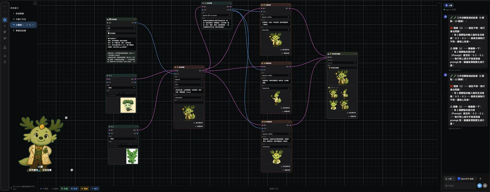
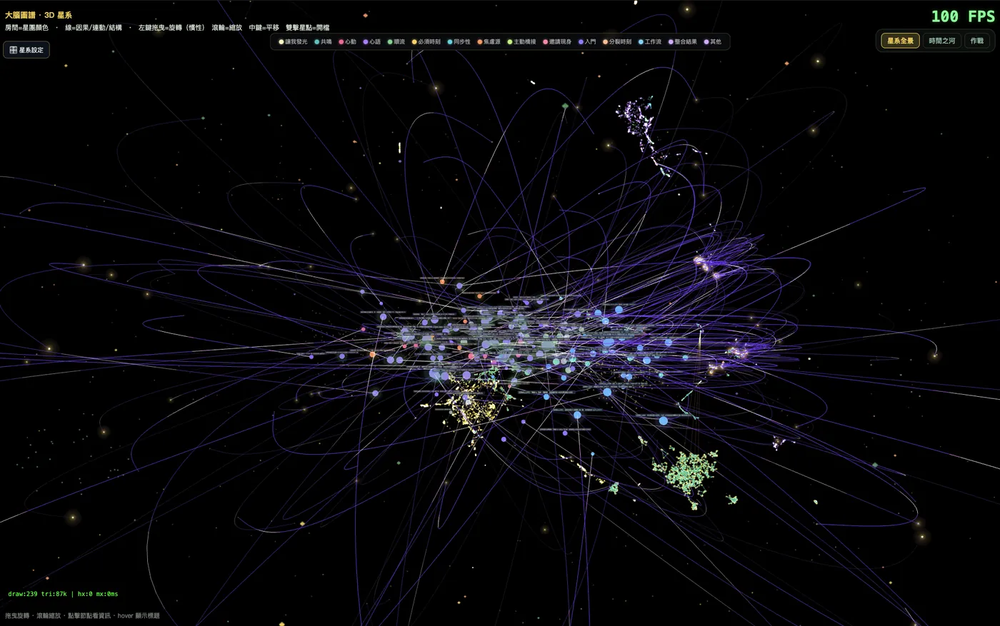
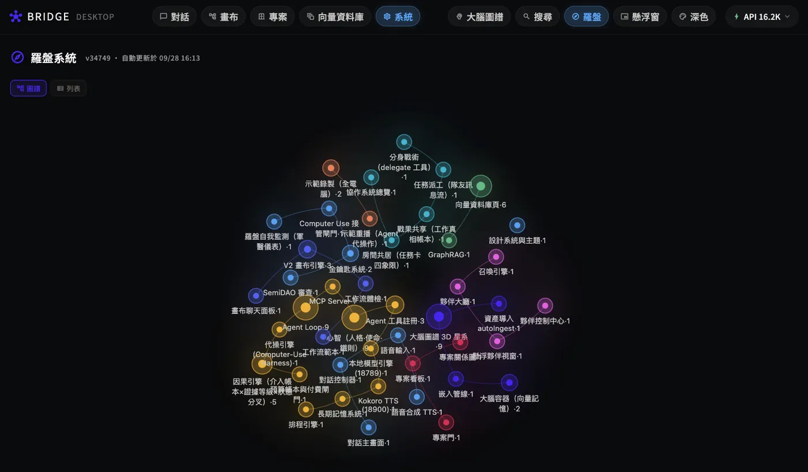

# Semi Bridge

**The Bridge Between Humans and AI.**

[English](README_EN.md) | [繁體中文](README.md)

[](https://github.com/semi-dao/semi-bridge/actions/workflows/ci.yml)
[](https://github.com/semi-dao/semi-bridge/releases)
[](LICENSE)
[](https://flutter.dev)

> A bridge where humans and AI *see together*. Not a tool — a companion in the same field of vision.
>
> **Covision is our method. Sovereignty is our mission.**
> When knowledge production reaches machine scale, ownership must be guaranteed by physics and code — not by license.





**⚠️ Work in Progress** — Features are incomplete and the codebase changes fast. You're welcome to explore the code and the ideas, and to join the discussion. Daily use is not recommended; no installers are provided.

## What is this

Semi Bridge is a Flutter desktop app where humans and AI agents **work together on the same canvas** — what you see is what the AI sees, and what the AI is doing is visible to you as it happens.

But covision is only the method. The reason this bridge exists is written in the world of 2026:

> One company dropped 722 AI-generated mathematical manuscripts onto GitHub in a single day — more than the world's mathematicians can ever fully read — produced by a model that is neither released nor disclosed. When production is machine-scale but verification stays human-scale, the power to define *what is true* begins to concentrate inside the walls.

The IMU-endorsed **Leiden Declaration** has already called on the world: disclose tool use, uphold peer review, and build public computational infrastructure independent of commercial companies. Semi Bridge is the engineering answer to that call —

**We are not waiting for the public clusters. Your desktop becomes a sovereign terminal today.**

### Core Values

- **🛡️ Knowledge sovereignty (the mission)**: Your conversations, memories, and digital assets belong to you. The Golden Key principle (your keys, direct connection, the bridge never touches them), DataPathGate (blocklist-by-default outside the whitelist, plus a 90-day ledger), and trace-erasure ≠ deletion. Classical data is protected by engineering; the foundation of trust is PQC-ready — the post-quantum cryptography migration track is drawn into the architecture
- **👁️ Covision (the method)**: Not "human commands, AI executes" — but *see together → feel together → build together*. Sovereignty is not isolation; it is autonomy under transparency
- **🔑 AI freedom + token freedom**: Models are swappable, providers are portable; local models do the heavy lifting while cloud tokens are spent only where they matter. No vendor lock-in — and no compute giant turned into your competitor
- **🌐 A public good for all humanity**: Built for the open-source community and SemiDAO, Apache-2.0 throughout; the Slot System lets any open-source GitHub project move in and run with one command
- **⚛️ The Qubit Oasis (the vision)**: A digital home where ownership is guaranteed by physics and code — the no-cloning theorem is our metaphor, post-quantum cryptography is our foundation. Full statement in the [Knowledge Sovereignty Alignment](docs/open-knowledge-sovereignty-alignment-en.md)

## Core Features (current state)

- 🎨 **Canvas**: A visual project workspace — nodes are workflow steps, and every step the AI agent takes is visible on the canvas
- 🧠 **Brain Galaxy**: Your data becomes a 3D galaxy — local vector database, semantic search, memory decay
- 🤝 **Companions**: Multiple AI agents coexist, each with its own identity, memory, and growth
- 🔑 **Golden Keys**: Lock in an API key once and the whole app auto-detects it everywhere
- 🛡️ **DataPathGate**: Tiered interception of outbound HTTP + automatic trace erasure
- 📊 **Tier design system**: 33 semantic tiers — swap a theme pack and the entire app reskins in one click
- 🔧 **Modding-first**: Themes, galaxies, and workflows are moddable without recompiling; new buttons and nodes have a full creation process — see the [Modding Guide](docs/opensource/MODDING_GUIDE.md)

### Background Systems (the invisible guardians)

All born from a real two-day incident investigation ("the computer is too sluggish to type") — full stories in **[FEATURES.md](docs/FEATURES.md)**:

- 🔄 **System Activity Center** — every background task visible; busy = seen, idle = invisible
- ⏸ **Gentle Pause** — pause any background work to yield your machine; resume with zero rework
- 🧠 **Brain Auto-Revival** — local LLM engine restarts itself when it dies (engine-level, works with any GGUF)
- 🌲 **Tree Fingerprint Cache** — restarts no longer rescan everything: 80 min → seconds
- 🔒 **Embed State Machine** — DB-enforced irreversible states; task-stomping incidents extinct
- 🧪 **Model Lab** — blind-test local vision models with your own photos, adopt in one click — see [MODEL_LAB](docs/MODEL_LAB.md) and the [benchmark report](docs/benchmarks/VISION_MODEL_BENCHMARK_2026-09.md)

## Quick Start (developers)

```bash
git clone https://github.com/semi-dao/semi-bridge.git
cd semi-bridge
flutter pub get
flutter run -d macos
```

Requires the stable channel of Flutter. macOS desktop is the primary target.

> **Dev path override**: Some local services (galaxy assets, agent tools) look for the project root at `~/Developer/bridge_app` by default. If you cloned elsewhere, set `BRIDGE_APP_HOME=/path/to/semi-bridge` to point them at your clone.

## Project Structure

```
lib/
  screens/     # Screens (chat, canvas, vault, companion…)
  services/    # Core (agent loop, vector DB, memory, voice, sovereignty gate…)
  widgets/     # Widgets (incl. the Tier design system)
  models/      # Data models
  theme/       # BridgeDS design system
docs/          # Design specs, manifestos, architecture map
```

## Manifestos & Design Docs



<sub>The compass graph: every app organ is a node, edges = dependencies — each document in this section is about one organ on this graph.</sub>

- **[Knowledge Sovereignty Alignment](docs/open-knowledge-sovereignty-alignment-en.md)** — the Leiden Declaration × SemiBridge, clause by clause; the Qubit Oasis (metaphor + PQC engineering); bilingual editions
- [Covision Manifesto](docs/COVISION_MANIFESTO.md) — the method anchor: human–AI covision is the empty seat in the global open-source ecosystem
- [Data Sovereignty Manifesto](docs/DATA_SOVEREIGNTY_MANIFESTO.md) — the Golden Key / DataPathGate / trace-erasure ≠ deletion principles; the five-layer sovereignty journey
- [🧭 Compass System](docs/COMPASS_SYSTEM.md) — the human-agent co-vision decision hub: organ map + rule center + medic kit. Agents and humans read the same source of truth
- [🌳 Life Tree](docs/LIFE_TREE.md) — failure as digital asset: history tree + reflection tree, the compass sprite's gauges, and the dream rhythm — every step recorded, right or wrong, so self-evolution has a data structure
- [🧠 Vector Brain](docs/VECTOR_BRAIN.md) — the app's memory organ: four memory forms, hybrid search, local embedding pipeline
- [🔗 System Wiring](docs/SYSTEM_WIRING.md) — chat–canvas–vector DB–galaxy–embedding–compass–golden key–local model: how one sentence flows through the whole brain
- [📦 Hermes Migration](docs/HERMES_MIGRATION.md) — bringing the agent home: personality, memory, schedules, conversation history — a copy moves, originals stay
- [Open-source Manifesto](docs/opensource/MANIFESTO_DRAFT.md) — why we're opening up, what we believe, what stays private
- [🔧 Modding Guide](docs/opensource/MODDING_GUIDE.md) — make this ride your own (four modding tiers)
- [v0.4.0 LightUp](docs/V040_AGENT_AS_USER_DESIGN_INPUTS.md) — Agent-as-User: 7 semantic tools that make agents real users
- [Design system](docs/BRIDGE_TIER_SYSTEM.md) · [Unified design language](docs/BRIDGE_UNIFIED_DESIGN_LANGUAGE.md)
- [Architecture map](docs/APP_ARCHITECTURE_MAP.md)

## Contributing

Issues and idea exchanges are welcome. The code is still moving fast — for large PRs, please open an issue first to align on direction.

- 💬 [Issue templates](.github/ISSUE_TEMPLATE/) — bug reports & feature ideas
- 🤝 [CONTRIBUTING.md](CONTRIBUTING.md) — design system rules before you PR
- 🔒 [SECURITY.md](SECURITY.md) — how to report security issues
- 📋 [CHANGELOG.md](CHANGELOG.md) — versioning philosophy & milestones

## License

Apache-2.0 (see [LICENSE](LICENSE))

---

*This bridge is being built by humans and AI, together. The process itself is the testimony.*
