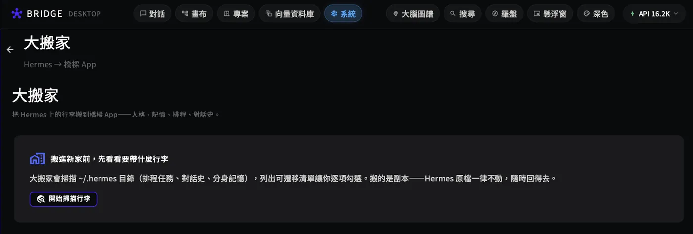

# 大搬家（Hermes Migration）— 把你的 Agent 接回家



<sub>系統頁 → 大搬家入口實機：搬的是副本——Hermes 原檔一律不動，隨時回得去。</sub>

## 一句話

**把 Hermes 上的行李搬到橋樑 App——人格、記憶、排程、對話史。搬的是副本，原檔不動。**

## 為什麼有大搬家

Agent 的家不該只有一個。你在 Hermes 上養了 Agent——它有記憶、有排程、有整段對話史——但 Agent 的主權屬於你：它應該能跟著你搬家，而不是被鎖在某一個平台。

大搬家是這個信念的實體化：**完整的你，跟著你走。**

## 流程：三步，每步都有知情權

```
1. 掃描行李（只讀不寫）
   掃 ~/.hermes：排程任務、對話史、分身記憶
   → 產出可遷移清單，附敏感內容偵測結果

2. 逐項勾選
   你決定帶什麼——每件行李的風險標記攤開來看

3. 執行搬遷
   只搬勾選的 → 產出遷移報告（~/migration_report.json）
```

## 五類行李與落點

| 行李 | 怎麼搬 | 落點 |
|---|---|---|
| **對話史** | 無損全搬（見下） | `migration_artifacts/conversations_lossless.jsonl` |
| **排程任務** | 直遷（生成型）/ 轉世（時間感掛鉤）/ 不遷（Hermes 基礎設施）三路處置建議 | `migration_pending_schedules.json` → 畫布 schedule 節點一鍵套用 |
| **分身記憶（Profile）** | 掃 profile 的 MEMORY/USER，產出待召喚 spec | 夥伴召喚流程 |
| **敏感內容** | 掃描前置：API key（sk-、ghp_、AKIA…）、疑似身分證、REDACTED 殘留——**掃描階段就標記，勾選時看見** | 只警示不判定，你拍板 |

## 兩條鐵則（寫在代碼裡的）

### 1. 無損搬移——不蒸餾，全搬

[Blue 拍板 2026-09-13] 對話史**不摘要、不精選、不壓縮**。4.6GB 拆解證實：真對話（user + assistant + reasoning）其實只有 ~77MB，其餘是索引與工具廢料——77MB 無妥協全帶。要查的是「你們的對話」，不是「對話的摘要」。

### 2. 指紋去重——相同的內容永遠只入庫一次

[917 重複事故 2026-09-25 根治] 每筆內容算 sha1(owner + title + content) 指紋，入庫前先查——marker 標記之外的第二道防線。事故教訓：marker 寫入失敗曾造成 917 條全量重複；指紋層讓「重跑第二次」時所有重複被攔下，增量搬家也自然成立。

## 主權設計

- **搬的是副本**：Hermes 原檔一律不動——大搬家不是離別，是開分號
- **敏感先看見**：記憶搬運是全量複製，API key 或個資若在原對話裡會一起進來——所以掃描階段（還沒寫入任何東西）就標記，你在勾選時看見風險
- **每步可回放**：遷移報告 JSON 記錄每一件行李的去向

## 相關

- 設計緣起：[Agent 移民系統 spec](specs/2026-09-13-agent-immigration-system.md)（召喚儀式 × 記憶歸屬 × 大搬家，2026-09-13 Blue 三拍板）
- 代碼：`lib/services/hermes_migration_service.dart`（掃描/執行）、`lib/services/hermes_lossless_importer.dart`（無損匯入+指紋去重）、`lib/screens/desktop/settings/hermes_migration_screen.dart`（UI）
